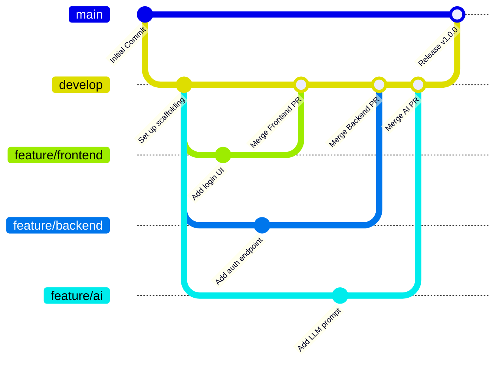

# Project LOOP - Team Collaboration & Git Workflow Guide

Welcome to the **AI Customer Feedback Intelligence Platform (Project LOOP)** team collaboration guide. This document outlines the Git branching strategy, daily development workflows, GitHub security controls, and step-by-step commands for all team members.

---

## 📌 1. Git Branching Strategy (Git Flow Lite)

To maintain a stable production application while allowing rapid feature development, we use a structured branching model:



1. **`main` (Production Branch)**
   * **Purpose**: Holds the official, stable, release-ready codebase.
   * **Rule**: **NEVER** push code directly to `main`. All code in `main` must come from a Pull Request (PR) merged from `develop`.
2. **`develop` (Integration Branch)**
   * **Purpose**: The main development pipeline where the team integrates their code.
   * **Rule**: Do not commit directly to `develop`. Features must be completed in `feature/*` branches and merged into `develop` via approved PRs.
3. **`feature/*` (Feature Branches)**
   * **Purpose**: Individual sandboxes for feature development.
   * **Branches**:
     * `feature/frontend` (Priyam's workspace)
     * `feature/backend` (Abhiudaya's workspace)
     * `feature/ai` (Aman's workspace)

---

## 🛠️ 2. Step-by-Step commands for Git Setup

### For the Repository Owner (Aman)
*(Note: These initial setup tasks have already been completed by Antigravity)*
```bash
# 1. Clone the empty repo
git clone https://github.com/yadavaman05/AI-Customer-Feedback-Intelligence-Platform.git
cd AI-Customer-Feedback-Intelligence-Platform

# 2. Add scaffolding files (.gitignore, README, folder structure)
git add .
git commit -m "Initial commit: Set up folder structure, README, and .gitignore"
git push origin main

# 3. Create and push 'develop' branch
git checkout -b develop
git push -u origin develop

# 4. Create and push feature branches
git checkout -b feature/backend
git push -u origin feature/backend

git checkout develop
git checkout -b feature/frontend
git push -u origin feature/frontend

git checkout develop
git checkout -b feature/ai
git push -u origin feature/ai
```

---

### For Teammates (Abhiudaya & Priyam)

When you set up your local development environment for the first time, follow these exact steps:

```bash
# 1. Clone the repository to your local machine
git clone https://github.com/yadavaman05/AI-Customer-Feedback-Intelligence-Platform.git

# 2. Change directory into the repository
cd AI-Customer-Feedback-Intelligence-Platform

# 3. Configure Git locally with your own name and email
git config user.name "Your GitHub Username"
git config user.email "your-email@example.com"

# 4. Fetch all remote branches from GitHub
git fetch --all

# 5. Switch to your assigned feature branch
# For Priyam:
git checkout feature/frontend

# For Abhiudaya:
git checkout feature/backend

# For Aman:
git checkout feature/ai
```

---

## 🔄 3. Explaining Essential Git Commands

Here is what each core Git command does and when to use it:

* `git clone <url>`: Downloads a complete copy of the remote repository and its histories to your local machine.
* `git checkout <branch>`: Swaps your current workspace to the specified branch. (Historically used to create branches via `git checkout -b <new-branch>`).
* `git switch <branch>`: A modern, safer alternative to `checkout` for switching branches. Use `git switch -c <new-branch>` to create and switch to a new branch.
* `git pull origin <branch>`: Fetches the latest commits from the remote branch on GitHub and merges them directly into your current local branch.
* `git add <file>` (or `git add .`): Stages changes, telling Git to include these file modifications in the next commit.
* `git commit -m "Message"`: Permanently saves your staged snapshot to your local Git history. Always write clear, descriptive messages (e.g. `feat: implement login authentication flow`).
* `git push origin <branch>`: Uploads your local commits to the remote repository on GitHub.
* `git merge <branch>`: Combines histories from the specified branch into your current active branch.

---

## 🔒 4. Restricting Direct Pushes to `main` & `develop`

To enforce code quality and protect the production branches, the Repository Owner (Aman) should configure **Branch Protection Rules** on GitHub.

### How to set Branch Protection on GitHub:
1. Go to the GitHub repository: https://github.com/yadavaman05/AI-Customer-Feedback-Intelligence-Platform.
2. Click **Settings** (top navigation bar).
3. Under the left sidebar, click **Branches**.
4. In the **Branch protection rules** section, click **Add branch ruleset** or **Add rule**.
5. Configure rules for both `main` and `develop`:

#### For `main` (Strict protection):
* **Branch name pattern**: `main`
* **Check the following settings**:
  * [x] **Require a pull request before merging**: This prevents direct pushing.
    * [x] **Require approvals**: Set to `1` (requiring either Aman, Abhiudaya, or Priyam to review and approve).
  * [x] **Require conversation resolution before merging**: Ensures all review comments are addressed.
  * [x] **Block force pushes**: Prevents rewriting history.
  * [x] **Require status checks to pass before merging** (Optional: select tests/linters if CI/CD is added later).

#### For `develop` (Integration protection):
* **Branch name pattern**: `develop`
* **Check the following settings**:
  * [x] **Require a pull request before merging** (Enforces reviews on develop integration).
    * [x] **Require approvals**: Set to `1`.
  * [x] **Block force pushes**.

---

## 🔀 5. Pull Requests (PR) & Review Process

Features must **never** be merged directly into `develop`. Instead, use Pull Requests on GitHub:

### Creating a Pull Request:
1. Push your latest commits to your feature branch on GitHub:
   ```bash
   git push origin feature/your-feature
   ```
2. Navigate to the repository page on GitHub.
3. You will see a banner saying *"feature/your-feature had recent pushes..."*. Click **Compare & pull request**.
4. Set the destination branch mapping correctly:
   * **base**: `develop` (Integration) 👈 *IMPORTANT: Do not select `main`*
   * **compare**: `feature/your-feature`
5. Write a clear description of what you did, referencing any issues.
6. Under **Reviewers**, assign the other team members to review your code.
7. Click **Create pull request**.

### Reviewing and Merging a PR:
1. The reviewer inspects the code changes under the **Files changed** tab.
2. The reviewer can leave inline comments or request changes.
3. If everything looks good, the reviewer clicks **Review changes** -> **Approve**.
4. Once approved, the author or reviewer clicks **Merge pull request** -> **Confirm merge**.
5. Delete the feature branch on GitHub if it is fully completed (optional).

---

## ⚡ 6. Safe Merge Conflict Resolution

Merge conflicts occur when two developers edit the same line of a file in different ways, and Git doesn't know which version to keep. Follow this safe workflow to resolve conflicts locally:

### How to resolve conflicts:
1. Pull the latest code from `develop` and switch to your feature branch:
   ```bash
   git checkout develop
   git pull origin develop
   git checkout feature/your-feature
   ```
2. Merge `develop` into your feature branch:
   ```bash
   git merge develop
   ```
3. If conflicts exist, Git will output:
   `CONFLICT (content): Merge conflict in path/to/conflict_file.ext`
4. Open the conflicting files in VS Code. VS Code will highlight the conflicts with options like:
   * *Accept Current Change* (Keeps your changes)
   * *Accept Incoming Change* (Keeps changes from `develop`)
   * *Accept Both Changes*
5. Alternatively, edit the file manually. Look for conflict markers:
   ```text
   <<<<<<< HEAD (Current local changes on your feature branch)
   api_port = 5000
   =======
   api_port = 8080 (Incoming changes from develop)
   >>>>>>> develop
   ```
   Delete the markers (`<<<<<<<`, `=======`, `>>>>>>>`) and edit the code to the desired unified state.
6. Stage the resolved files:
   ```bash
   git add path/to/conflict_file.ext
   ```
7. Commit the merge:
   ```bash
   git commit -m "chore: resolve merge conflicts with develop"
   ```
8. Push your branch safely:
   ```bash
   git push origin feature/your-feature
   ```

---

## 📅 7. Daily Workflow for Developers

Follow this daily loop to minimize code drift and prevent painful merge conflicts:

### Morning (Before starting work)
Always sync your local machine with GitHub:
```bash
# 1. Fetch all updates from the server
git fetch --all

# 2. Update your local develop branch
git checkout develop
git pull origin develop

# 3. Switch to your feature branch
git checkout feature/your-feature # e.g., feature/backend

# 4. Integrate latest develop changes into your feature branch
git merge develop
```

### Afternoon / Coding Phase
* Write code, run local builds, verify functionality.
* Commit in logical increments:
  ```bash
  git add .
  git commit -m "feat: add customer sentiment analyzer endpoint"
  ```

### Evening (Before pushing code)
Always make sure your code merges cleanly with `develop` before creating a PR:
```bash
# 1. Fetch any new changes other team members merged today
git checkout develop
git pull origin develop

# 2. Merge develop into your branch locally
git checkout feature/your-feature
git merge develop

# 3. Run tests locally to make sure the merge didn't break anything

# 4. Push your branch to GitHub
git push origin feature/your-feature
```

---

## 🧩 8. Project LOOP Module Division

To maximize efficiency and avoid cross-contributions conflicts, divide tasks cleanly:

### 🎙️ 1. Frontend Module (`feature/frontend`) - Assigned to **Priyam Rai**
* **Scope**: Build interactive dashboard, customer feedback ingestion forms, sentiment analysis visualizations, and settings pages.
* **Key Tasks**:
  * Implement TailwindCSS layouts and charts (using Recharts or Chart.js).
  * Build state management (React Context or Zustand) to cache analytics.
  * Integrate REST clients (Axios/Fetch) to interact with backend endpoints.

### ⚙️ 2. Backend Module (`feature/backend`) - Assigned to **Abhiudaya Pratap Singh**
* **Scope**: Maintain user authentication, session state, database schemas, API routes, and webhook processing.
* **Key Tasks**:
  * Set up database models (PostgreSQL/MongoDB) and CRUD actions.
  * Write auth middleware (JWT-based session authentication).
  * Build webhooks or ingestion APIs to gather customer feedback from third-party channels (Slack, Email, Typeform).

### 🤖 3. AI Service Module (`feature/ai`) - Assigned to **Aman Kumar Yadav**
* **Scope**: Develop LLM pipelines, sentiment analytics, and semantic searches over feedback database.
* **Key Tasks**:
  * Design OpenAI/HuggingFace API connectors for automated categorization and sentiment scoring.
  * Construct vector database integration (Pinecone/Chroma) for semantic search.
  * Design feedback synthesis pipelines to generate automated summary reports.

---

## 🔐 9. Critical Security Note on `.env` Files

**NEVER** commit credentials, API keys, passwords, database connections, or `.env` files to Git. 

1. We have added standard `.env*` formats to `.gitignore`.
2. Each developer should copy `.env.example` to `.env` locally and populate it with their local secrets.
3. **If a credential is accidentally pushed**:
   1. Revoke the key immediately on the service provider.
   2. Remove the file using:
      ```bash
      git rm --cached .env
      git commit -m "security: remove env file from tracking"
      git push origin your-branch
      ```
